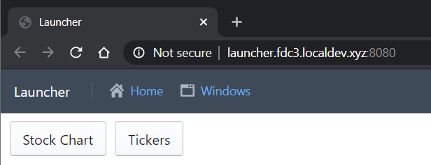

# FDC3 Desktop Agent | Example Web Implementation

## Build and run
1. Clone the repo
1. `npm install`
1. `npm run-script bootstrap`
1. `npm run-script build`
1. `npm test`
1. `npm start`
1. Open http://launcher.fdc3.localdev.xyz:8080/

## Launcher

